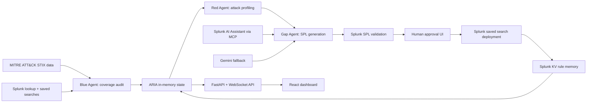

# ARIA

Autonomous Red-Blue Intelligence Agent for Splunk detection coverage.

Most organizations using Splunk can detect fewer than 10% of known MITRE ATT&CK techniques. In our own live Splunk environment, ARIA measured exactly 6.1%: 311 of 354 techniques with zero detection coverage. The remaining 90% are silent blind spots.

ARIA audits an organization's Splunk detection posture against MITRE ATT&CK, identifies uncovered techniques, generates validated SPL detection candidates with AI, and routes those candidates through a human approval workflow before deploying them back into Splunk.

> **Reproducible demo mode included.**
> ARIA ships with a built-in deterministic demo mode for offline reproducibility and judging flow walkthroughs. Live mode runs against real Splunk services for coverage audit, SPL validation, deployment, and rule lifecycle persistence.

## Why It Matters

Security teams often know they have detection gaps, but turning that knowledge into validated, reviewable Splunk detections is slow. ARIA closes that loop:

1. Audit existing Splunk coverage against MITRE ATT&CK.
2. Profile uncovered adversary techniques.
3. Generate SPL detections using Splunk AI Assistant through MCP, with Gemini as fallback.
4. Validate generated SPL against Splunk before humans review it.
5. Stage approvals in a UI.
6. Deploy approved rules to Splunk saved searches.
7. Persist rule lifecycle memory in Splunk KV Store.

The result is an agentic security workflow that moves from coverage awareness to validated detection action.

## Hackathon Fit

Track: Security

Challenge alignment:

- Detect threats faster by generating SPL detections for uncovered ATT&CK techniques.
- Investigate coverage posture more efficiently through an agent-maintained coverage catalog.
- Automate security workflows while keeping humans in the approval loop.
- Use Splunk platform data, saved searches, lookup data, SPL validation, KV Store, and Splunk AI/MCP capabilities.

## Quick Reviewer Links

- Demo video: https://youtu.be/e8mCmHSdUs0?si=VbXvtYNXLLXFglIU
- Architecture diagram: [architecture_diagram.md](architecture_diagram.md)
- MCP client implementation: [`core/splunk_mcp_client.py`](core/splunk_mcp_client.py)
- MCP-first generation flow: [`agents/gap_agent.py`](agents/gap_agent.py)
- Splunk SDK integration: [`core/splunk_client.py`](core/splunk_client.py)
- Demo fixture used for deterministic runs: [`scripts/demo_state.json`](scripts/demo_state.json)

## Splunk AI Capabilities Used

ARIA is designed with **Splunk AI Assistant via Splunk MCP Server as the primary runtime generation path** for SPL detections.

At runtime, ARIA attempts to discover and call Splunk AI Assistant MCP tools for:

- SPL generation
- SPL optimization
- SPL explanation

Implementation references:

- [`core/splunk_mcp_client.py`](core/splunk_mcp_client.py) (MCP JSON-RPC client, tool discovery, tool invocation)
- [`agents/gap_agent.py`](agents/gap_agent.py) (MCP-first generation flow, provider selection, provider tracing)

For resiliency, ARIA includes a Gemini fallback path **only when MCP is unavailable or rejects requests**.

## Runtime Note for This Submission

During the submission window, our Splunk trial tenant's SAIA activation consistently failed with:

> `Error generating Splunk Cloud access token.`

Because of this platform-side activation blocker, recorded runs may show fallback generation for some techniques.

Even in this state, ARIA still executes live Splunk runtime operations:

- MITRE coverage audit from Splunk lookup data
- SPL parser validation in Splunk
- Saved-search deployment workflow
- KV Store lifecycle persistence

## Evidence Included in This Submission

This repository and submission package include:

- Source code proving MCP-first runtime integration ([`agents/gap_agent.py`](agents/gap_agent.py), [`core/splunk_mcp_client.py`](core/splunk_mcp_client.py))
- Runtime behavior is visible in application logs, including MCP-attempt and fallback paths.

## Compliance and Transparency Statement

ARIA is not a mock-only prototype. It executes real runtime logic against Splunk APIs and includes implemented Splunk AI integration.

Where SAIA activation could not be completed due to tenant provisioning issues, behavior and evidence are documented transparently in this submission.

## Core Capabilities

- Full MITRE ATT&CK technique audit using the local ATT&CK STIX dataset.
- Splunk coverage mapping from `mitre_all_rule_compliance_lookup.csv`.
- Reconciliation of ARIA-created saved searches back into coverage counts.
- Red Agent attack profiling from MITRE technique descriptions, tactics, and detection guidance.
- Gap Agent SPL generation through Splunk AI Assistant MCP tools.
- Gemini fallback when MCP generation is unavailable.
- SPL parser validation through the Splunk SDK before approval.
- Human-in-the-loop approval and rejection queue.
- Saved-search deployment for approved detections.
- Splunk KV Store persistence for generated rule memory.
- Demo mode that runs without external Splunk or AI dependencies.
- React UI with live WebSocket updates, coverage metrics, reasoning log, catalog, inspector, and approvals queue.

## Architecture

The diagram below is a quick overview. For full system documentation including the pipeline sequence diagram and agent integration details, see [architecture_diagram.md](architecture_diagram.md).



## Repository Layout

```text
ARIA/
  agents/
    blue_agent.py        # Splunk coverage auditor
    red_agent.py         # ATT&CK attack profiler
    gap_agent.py         # AI SPL generation and validation
    orchestrator.py      # Pipeline coordination and approval lifecycle
  api/
    server.py            # FastAPI API and WebSocket server
  core/
    state.py             # Thread-safe ARIA state model
    splunk_client.py     # Splunk SDK integration
    splunk_mcp_client.py # MCP JSON-RPC client for Splunk AI tools
    mitre_loader.py      # ATT&CK STIX loader
    demo_loader.py       # Deterministic demo fixture loader
  frontend/
    src/                 # React, TanStack Router, React Query UI
  scripts/
    demo_state.json      # Demo-mode fixture
    test_connection.py   # Splunk connection diagnostics
    run_live_audit.py    # CLI live coverage audit
    test_gap.py          # Gap Agent visual smoke test
  tests/                 # Python unit tests
```

## Prerequisites

Required for demo mode:

- Python 3.10 or newer
- Node.js 20 or newer
- pnpm 9 or newer

Required for live Splunk mode:

- A reachable Splunk Enterprise or Splunk Cloud-compatible management endpoint
- Splunk credentials with access to saved searches, lookup tables, parser validation, and KV Store
- A `mitre_all_rule_compliance_lookup.csv` lookup available in Splunk
- Splunk MCP Server & Splunk AI Assistant installed and configured
- Gemini API key only for using Gemini as fallback

## Environment Variables

Create a `.env` file in the repository root. Use `.env.example` as the starting point.

Important variables:

| Variable                     | Required      | Description                                                  |
| ---------------------------- | ------------- | ------------------------------------------------------------ |
| `SPLUNK_HOST`                | Live mode     | Splunk management host, usually `localhost` for local Splunk |
| `SPLUNK_PORT`                | Live mode     | Splunk management port, usually `8089`                       |
| `SPLUNK_USERNAME`            | Live mode     | Splunk username                                              |
| `SPLUNK_PASSWORD`            | Live mode     | Splunk password                                              |
| `SPLUNK_MCP_URL`             | MCP mode      | Splunk MCP Server endpoint                                   |
| `SPLUNK_MCP_TOKEN`           | MCP mode      | Bearer token for the MCP endpoint                            |
| `SPLUNK_MCP_VERIFY_SSL`      | Optional      | Set `false` for local/self-signed Splunk dev environments    |
| `SPLUNK_AI_PRIMARY`          | Optional      | `true` uses MCP first, then Gemini fallback                  |
| `GEMINI_API_KEY`             | Fallback mode | Required only when MCP is unavailable or disabled            |
| `ARIA_DEMO_MODE`             | Demo mode     | `true` bypasses external Splunk and AI dependencies          |
| `ARIA_DEMO_FIXTURE_PATH`     | Demo mode     | Fixture path, default `scripts/demo_state.json`              |
| `ARIA_DEMO_SIMULATE_RUN_SEC` | Demo mode     | Demo pipeline duration in seconds                            |

Do not commit real credentials. Rotate any key or token that has been exposed in local files or screenshots.

## Quick Start: Demo Mode

Demo mode is the recommended path for judging, screenshots, and offline review. It uses deterministic fixture data and does not require a real Splunk instance, MCP, or Gemini.

### 1. Backend setup

PowerShell:

```powershell
cd ARIA
py -3 -m venv venv
.\venv\Scripts\Activate.ps1
pip install -r requirements.txt
```

macOS/Linux:

```bash
cd ARIA
python3 -m venv venv
source venv/bin/activate
pip install -r requirements.txt
```

### 2. Configure demo mode

Create `.env`:

```env
ARIA_DEMO_MODE=true
ARIA_DEMO_FIXTURE_PATH=scripts/demo_state.json
ARIA_DEMO_SIMULATE_RUN_SEC=12
```

### 3. Start the API

```powershell
python main.py
```

The API starts on:

```text
http://localhost:8080
```

### 4. Frontend setup

Open a second terminal:

```powershell
cd frontend
pnpm install
pnpm run dev
```

The UI starts on Vite's printed local URL, usually:

```text
http://localhost:5173
```

## Quick Start: Live Splunk Mode

Use live mode when demonstrating real Splunk coverage, SPL validation, saved-search deployment, and KV rule memory.

### 1. Configure `.env`

```env
ARIA_DEMO_MODE=false

SPLUNK_HOST=localhost
SPLUNK_PORT=8089
SPLUNK_USERNAME=admin
SPLUNK_PASSWORD=replace-with-your-password

SPLUNK_MCP_URL=https://localhost:8089/services/mcp
SPLUNK_MCP_TOKEN=replace-with-your-mcp-token
SPLUNK_MCP_VERIFY_SSL=false
SPLUNK_AI_PRIMARY=true

SPLUNK_MCP_TOOL_GENERATE=saia_generate_spl
SPLUNK_MCP_TOOL_OPTIMIZE=saia_optimize_spl
SPLUNK_MCP_TOOL_EXPLAIN=saia_explain_spl

GEMINI_API_KEY=replace-with-your-gemini-api-key-if-using-fallback
```

### 2. Check Splunk connectivity

```powershell
python scripts/test_connection.py
```

This verifies:

- Splunk login
- Saved search read access
- MITRE compliance lookup visibility
- SPL parser validation

### 3. Run the app

Backend:

```powershell
python main.py
```

Frontend:

```powershell
cd frontend
pnpm run dev
```

## API Reference

Base URL:

```text
http://localhost:8080
```

Endpoints:

| Method | Path                             | Purpose                                    |
| ------ | -------------------------------- | ------------------------------------------ |
| `GET`  | `/api/health`                    | API, run, phase, and demo-mode status      |
| `GET`  | `/api/state`                     | Current pipeline summary                   |
| `GET`  | `/api/techniques`                | All audited techniques                     |
| `GET`  | `/api/techniques?verdict=GAP`    | Filtered techniques                        |
| `GET`  | `/api/techniques/{technique_id}` | Technique detail                           |
| `GET`  | `/api/pending`                   | Pending approval queue                     |
| `POST` | `/api/run`                       | Start pipeline; body: `{ "gap_limit": 3 }` |
| `POST` | `/api/approve/{technique_id}`    | Deploy approved rule                       |
| `POST` | `/api/reject/{technique_id}`     | Reject staged rule                         |
| `WS`   | `/ws`                            | Live state snapshots                       |

## Demo Walkthrough

1. Open the Overview page.
2. Point out current coverage score, gap count, pending approvals, and demo mode.
3. Set Gap limit to `3`.
4. Click Start Run.
5. Show the live reasoning log:
   - Blue Agent audits Splunk coverage.
   - Red Agent profiles ATT&CK gaps.
   - Gap Agent stages generated SPL detections.
6. Open Techniques and filter to `GAP`.
7. Click a technique and inspect:
   - ATT&CK context
   - Attack profile
   - Generated SPL
   - Provider trace
8. Open Approvals.
9. Approve one rule.
10. Return to Overview and show rules approved/deployed and coverage lift.

## Testing and Validation

Backend tests:

```powershell
python -m unittest discover -s tests
```

Frontend typecheck:

```powershell
cd frontend
pnpm exec tsc -b
```

Frontend lint:

```powershell
cd frontend
pnpm run lint
```

Production frontend build:

```powershell
cd frontend
pnpm run build
```

## Troubleshooting

### `python` is not recognized on Windows

Use the Python launcher:

```powershell
py -3 -m venv venv
```

Then activate the virtual environment:

```powershell
.\venv\Scripts\Activate.ps1
```

### PowerShell blocks virtualenv activation

Run:

```powershell
Set-ExecutionPolicy -Scope CurrentUser RemoteSigned
```

Then retry:

```powershell
.\venv\Scripts\Activate.ps1
```

### Splunk connection fails

Check:

- `SPLUNK_HOST`, `SPLUNK_PORT`, `SPLUNK_USERNAME`, and `SPLUNK_PASSWORD`
- Splunk management port `8089` is reachable
- The Splunk user can list saved searches and run searches
- Local SSL verification settings for self-signed certificates

### MCP generation fails

Check:

- `SPLUNK_MCP_URL`
- `SPLUNK_MCP_TOKEN`
- `SPLUNK_MCP_VERIFY_SSL`
- Tool names:
  - `SPLUNK_MCP_TOOL_GENERATE`
  - `SPLUNK_MCP_TOOL_OPTIMIZE`
  - `SPLUNK_MCP_TOOL_EXPLAIN`

If MCP is unavailable and `GEMINI_API_KEY` is configured, ARIA falls back to Gemini.

### MITRE dataset is missing

`MitreLoader` downloads the ATT&CK dataset into `data/attack.json` when needed. If the machine has no network access, use demo mode or provide the dataset file manually.

### Frontend cannot reach API

By default, the frontend calls:

```text
http://localhost:8080
```

Override with:

```env
VITE_API_BASE_URL=http://localhost:8080
```

Place that value in `frontend/.env` because Vite loads frontend environment variables from the frontend project directory.

## Security Notes

- ARIA never deploys generated detections automatically. Human approval is required.
- Generated SPL is validated with Splunk before it is staged for approval.
- Demo mode bypasses external systems and is safe for presentation.
- Live mode can create saved searches in Splunk after approval.
- Treat `.env`, MCP tokens, Splunk credentials, and Gemini keys as secrets.

## Current Limitations

- Runtime state is in memory; run history is not persisted outside the process.
- Rule lifecycle metadata is persisted in Splunk KV Store only in live mode.
- The current ATT&CK loader tracks top-level enterprise techniques, not every sub-technique.
- Generated detections are candidates and should be reviewed by a security analyst before production scheduling.

## License

MIT License. See [LICENSE](LICENSE).
