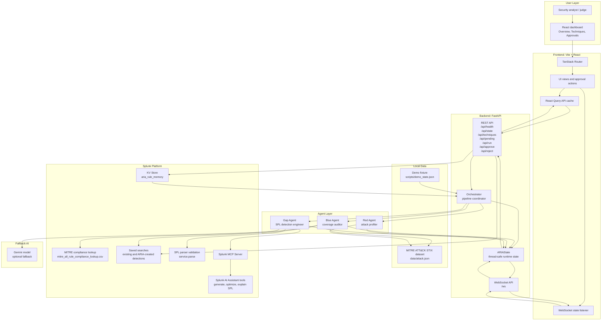
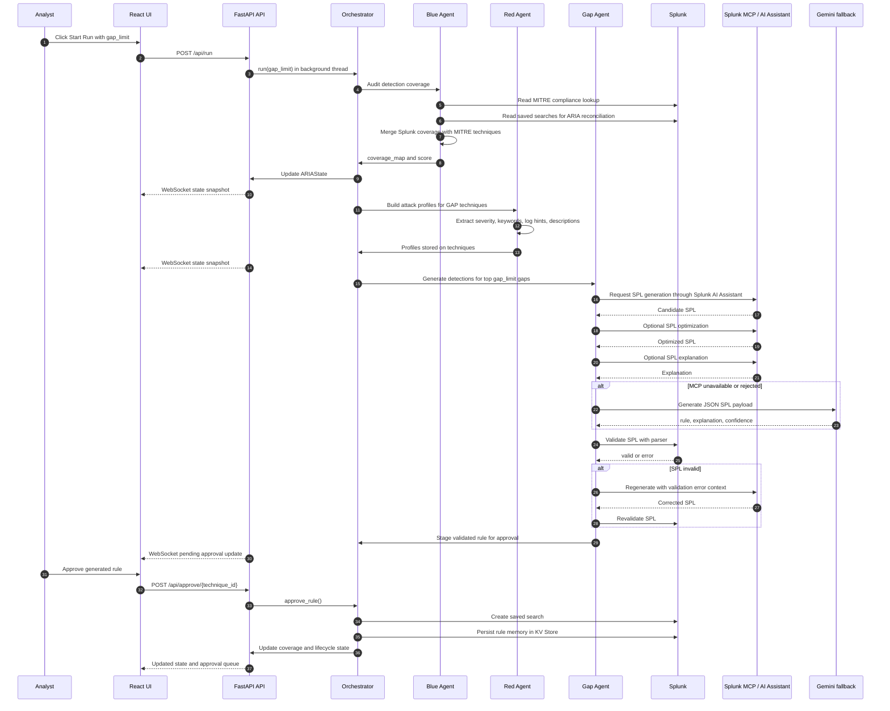

# ARIA Architecture Diagram

This document shows how ARIA works end to end, including how it interacts with Splunk, how AI agents and models are integrated, and how data flows between the backend, frontend, Splunk, MCP, and model services.

## System Overview

## Pipeline Flow

## Splunk Interaction

ARIA interacts with Splunk through the Python Splunk SDK and the Splunk MCP Server.

| Splunk capability | ARIA component | Purpose |
| --- | --- | --- |
| `mitre_all_rule_compliance_lookup.csv` lookup | Blue Agent | Reads existing ATT&CK mapped rule coverage |
| Saved searches | Blue Agent | Reconciles ARIA-created detections into coverage counts |
| Saved search creation | Orchestrator approval flow | Deploys approved generated SPL as a Splunk saved search |
| SPL parser validation | Gap Agent | Validates generated SPL before it reaches human approval |
| KV Store collection `aria_rule_memory` | Orchestrator and SplunkClient | Persists generated rule lifecycle fields |
| Splunk MCP Server | Gap Agent and SplunkMCPClient | Calls Splunk AI Assistant tools for SPL generation, optimization, and explanation |

## AI and Agent Integration

ARIA uses a multi-agent workflow. Each agent owns a distinct responsibility and passes structured state forward.

### Blue Agent: Coverage Auditor

Inputs:

- MITRE ATT&CK technique data
- Splunk ATT&CK compliance lookup
- Existing Splunk saved searches

Outputs:

- Per-technique verdict: `COVERED`, `PARTIAL`, or `GAP`
- Coverage score
- Counts for covered, partial, and gap techniques

Role:

- Establishes the detection baseline.
- Identifies which ATT&CK techniques have no enabled Splunk coverage.

### Red Agent: Attack Profiler

Inputs:

- GAP techniques from `ARIAState`
- MITRE technique name, tactics, description, and detection guidance

Outputs:

- Attack profile per gap technique
- Severity
- Keywords
- Likely log sources
- Detection hints

Role:

- Converts a coverage gap into security context that the detection-generation agent can use.

### Gap Agent: SPL Detection Engineer

Inputs:

- Attack profiles from Red Agent
- Optional previous SPL validation errors

Primary AI path:

- Splunk AI Assistant through Splunk MCP Server
- Tools:
  - `saia_generate_spl`
  - `saia_optimize_spl`
  - `saia_explain_spl`

Fallback AI path:

- Gemini model through `google-genai`
- Used only when MCP is unavailable or configured to fall back

Outputs:

- Validated SPL
- Explanation
- Confidence when provided by fallback model
- Provider trace
- Pending approval item

Role:

- Generates candidate detections.
- Validates them against Splunk.
- Retries with parser error context when SPL is invalid.
- Stages only validated rules for human review.

## Data Flow Between Components

### 1. Startup

Live mode:

1. FastAPI lifespan initializes `SplunkClient`.
2. `SplunkClient.connect()` authenticates to Splunk.
3. `Orchestrator.bootstrap_state_from_splunk()` runs an initial Blue Agent audit.
4. Persisted rule memory is hydrated from Splunk KV Store.
5. The UI can immediately show current coverage posture.

Demo mode:

1. FastAPI lifespan bypasses external Splunk and AI clients.
2. `scripts/demo_state.json` is loaded into `ARIAState`.
3. Deterministic state is available for the UI.
4. The full simulated pipeline can run without Splunk, MCP, or API keys.

### 2. Run Request

1. The UI sends `POST /api/run` with a `gap_limit`.
2. FastAPI starts the orchestrator in a background executor.
3. `is_running` prevents concurrent pipeline runs.
4. WebSocket clients receive state snapshots every 0.5 seconds.

### 3. Coverage Audit

1. Blue Agent loads MITRE techniques.
2. Blue Agent queries Splunk lookup coverage.
3. Blue Agent merges ARIA-created saved searches.
4. Blue Agent computes verdicts and score.
5. Orchestrator writes results into `ARIAState`.

### 4. Attack Profiling

1. Red Agent reads GAP techniques.
2. Red Agent builds attack profiles from MITRE context.
3. Profiles are stored on each `TechniqueState`.
4. Reasoning log entries are streamed to the UI.

### 5. SPL Generation and Validation

1. Gap Agent selects profiled GAP techniques up to `gap_limit`.
2. Gap Agent calls Splunk MCP tools to generate SPL.
3. If MCP fails and Gemini is configured, Gap Agent falls back to Gemini.
4. Gap Agent validates SPL through Splunk parser validation.
5. Invalid SPL is retried with the validation error included as correction context.
6. Validated rules are marked `pending_approval`.

### 6. Human Approval

1. The UI loads pending rules from `GET /api/pending`.
2. A user approves or rejects a rule.
3. Approval creates a Splunk saved search.
4. Approval persists lifecycle memory in Splunk KV Store.
5. ARIA updates in-memory coverage so the UI reflects the rule as deployed.
6. Rejection clears the generated rule so it can be regenerated in a later run.

## Runtime Modes

| Mode | External dependencies | Purpose |
| --- | --- | --- |
| Demo mode | None beyond Python and Node dependencies | Reliable judging, screenshots, offline review |
| Live Splunk mode | Splunk, lookup data, saved searches, Splunk credentials | Real coverage audit, validation, deployment, KV memory |
| MCP-first AI mode | Splunk MCP Server and Splunk AI Assistant | Splunk-native SPL generation, optimization, and explanation |
| Gemini fallback mode | Gemini API key | Backup generation path when MCP is unavailable |

## Trust and Safety Boundaries

- ARIA does not deploy generated detections automatically.
- Human approval is required before a generated rule becomes a Splunk saved search.
- Generated SPL is parser-validated before being staged.
- Approval state is persisted in Splunk KV Store in live mode.
- Demo mode avoids external systems entirely.

## Key Files

| File | Responsibility |
| --- | --- |
| `main.py` | Starts the FastAPI app through Uvicorn |
| `api/server.py` | REST endpoints, WebSocket streaming, startup lifecycle |
| `agents/orchestrator.py` | Pipeline coordination and approval lifecycle |
| `agents/blue_agent.py` | Splunk coverage audit |
| `agents/red_agent.py` | ATT&CK attack profile generation |
| `agents/gap_agent.py` | AI SPL generation, validation, retry, staging |
| `core/splunk_client.py` | Splunk SDK integration |
| `core/splunk_mcp_client.py` | JSON-RPC client for Splunk MCP Server |
| `core/state.py` | Thread-safe state model |
| `core/mitre_loader.py` | MITRE ATT&CK dataset loader |
| `frontend/src/routes/index.tsx` | Overview and live pipeline controls |
| `frontend/src/routes/techniques.tsx` | Coverage catalog |
| `frontend/src/routes/approvals.tsx` | Human approval workflow |
